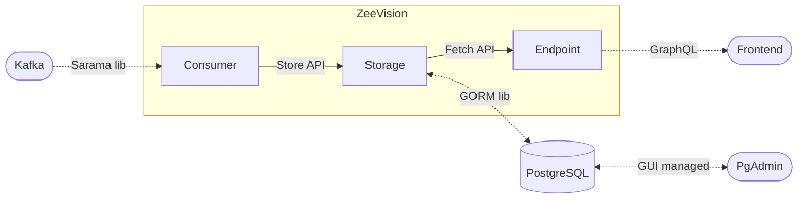

# ZeeVision Backend

- [ZeeVision Backend](#zeevision-backend)
  - [Build and Run](#build-and-run)
  - [API and Playground](#api-and-playground)
  - [GUI database management](#gui-database-management)
    - [Environment variables](#environment-variables)
    - [Set up and access step-by-step](#set-up-and-access-step-by-step)
    - [Filling database with data](#filling-database-with-data)
  - [Architecture](#architecture)
  - [Directory structure](#directory-structure)
  - [Development guidelines](#development-guidelines)
    - [File naming](#file-naming)
    - [Named return values and Naked returns](#named-return-values-and-naked-returns)
    - [Updating type and query definitions](#updating-type-and-query-definitions)

This subdirectory contains code for the backend of the ZeeVision application. It serves GraphQL based API for the frontend and consumes Kafka stream of Zeebe data. Backend uses PostgreSQL to store information
received from Kafka.

## Build and Run

Building and running the whole stack (backend and frontend) is done by running

```bash
$ docker compose up --build
```

in the root directory of the project. Use the `--build` flag to ensure the images used are up-to-date. You may need to `docker image prune` once in a while to clean up old images.

Docker will build the backend and frontend separately, and combine them to single image where backend serves the frontend. The app will be available at `localhost:8080`. The API will be available at `localhost:8081/graphql` and the API Playground at `localhost:8081/playground`.

## API and Playground

When backend is running locally, you can access [`localhost:8081/playground`](http://localhost:8081/playground) to try out the API. For more information about the playground, see [GraphiQL](https://github.com/graphql/graphiql/tree/main/packages/graphiql).

To try out the API Playground, try putting the query below to the query field and executing it with the pink arrow.

```graphql
query ManyProcesses {
    processes {
        bpmnProcessId
        processKey
    }
}
```

You should see a JSON response with structure similar to this:

```json
{
  "data": {
    "processes": [
      {
        "bpmnProcessId": "multi-instance-process",
        "processKey": 1
      },
      {
        "bpmnProcessId": "money-loan",
        "processKey": 2
      }
    ]
  }
}
```

The whole GraphQL API schema is defined [here](../backend/graph/schema.graphqls), and it is used directly by [gqlgen](https://gqlgen.com/) to generate Go code.

## GUI database management

With `pgadmin`, you can perform query, visualise data, utilize dashboards, etc with GUI. See more [here](https://www.pgadmin.org/docs/pgadmin4/7.8/index.html)

### Environment variables

- `POSTGRES_DB`: zeevision_db
- `POSTGRES_USER`: user
- `POSTGRES_PASSWORD`: pass
- `HOST`: postgres
- `PGADMIN_EMAIL`: user@example.com
- `PGADMIN_PASSWORD`: pass

Defined in [docker-compose.yml](../docker-compose.yml)

### Set up and access step-by-step

1.  After backend is running, open login page through [`localhost:5050`](http://localhost:5050)
2. Log in with `PGADMIN_EMAIL` and `PGADMIN_PASSWORD`
3. In *Quick Links* box, choose **Add New Server**, then it will pop up *Register-Server* modal 
4. In *General* tab, put `POSTGRES_DB` into *Name* field
5. In *Connection* tab, 
   - put `HOST` into **Host name/address** field
   - put `POSTGRES_USER` into **Username** field
   - put `POSTGRES_PASSWORD` into **Password** field
6. Choose **Save**

After this you should see *Servers* on the right menu.

### Filling database with data

You can use [`fill_db.sql`](test/data/fill_db.sql) to fill the database with some data. You can open the *Query Tool* for the database, paste the contents of the file there, and execute it. You can also use the *Query Tool* to execute any other SQL queries you want.

## Architecture

Simplified architecture diagram of ZeeVision and its relation Kafka, PostgreSQL and the frontend:



Consumer has connection to Kafka and streams them directly to _Storage_ using its provided **Store API**. Consumer here indirectly filters unnecessary information from the received messages when converting to Storage compatible types. Storage has **Fetch API** which is used by the _Endpoint_ to fetch data from the database. Endpoint has GraphQL API which is used by the _Frontend_ to query data from the backend. Arrows in the diagram show the direction of the data flow.

## Directory structure

This directory mostly follows the [standard Go project layout](https://github.com/golang-standards/project-layout). The most important directories are:

- [`cmd`](cmd): Contains the main entrypoint of the application.
- [`graph`](graph): Contains the GraphQL schema and generated code.
- [`internal`](internal): Contains the internal packages of the application. These are not meant to be imported from outside the application for any reason.

## Development guidelines

Useful resources about Go:

- [Effective Go](https://go.dev/doc/effective_go)
- [Go by Example](https://gobyexample.com/)

Below are some exceptions and additions to the guidelines.

### File naming

- Use nouns and `snake_case` for file names.
- Prefer concise names which describe the content of the file.

### Named return values and Naked returns

- Prefer to not use named return values. Return values should be obvious from the context, their types, and finally from the function/method comment.
- Don't use naked returns. They make the code harder to read and understand.

### Updating type and query definitions

During the development process, it is sometimes required to update type and queries, e.g., for `Process`, `Instance`, `Timer`, etc. All the changes must be made in `graph/schema.graphqls`:
- Open the file and navigate to the type/query you want to update.
- Update the type / query with correct fields.
- Under `/backend`, run `./run_gqlgen.sh` to update query in automatically generated files (`generated.go`, `models_gen.go`, `schema.resolvers.go`). DO NOT manually update those files (except `schema.resolvers.go` as the functions here create the query itself).
- Open the playground to test the new changes.
