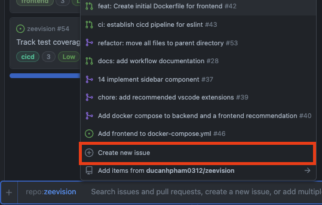
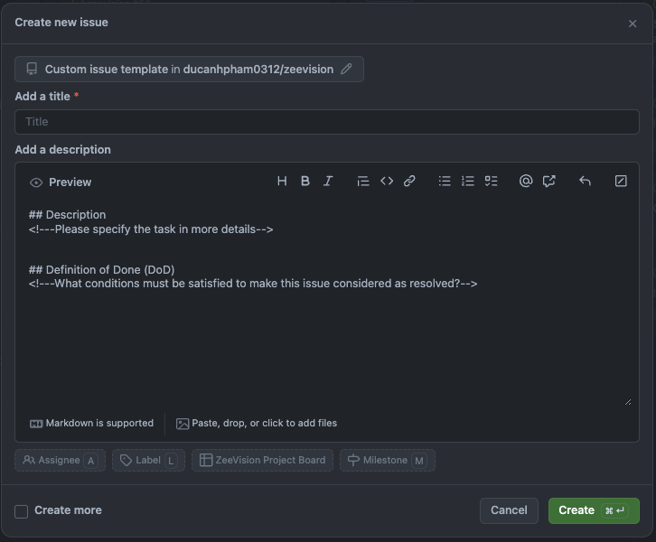
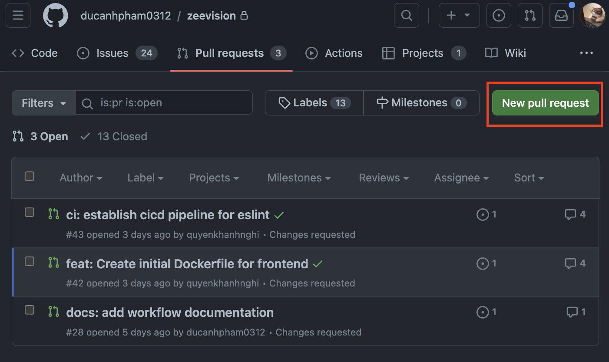
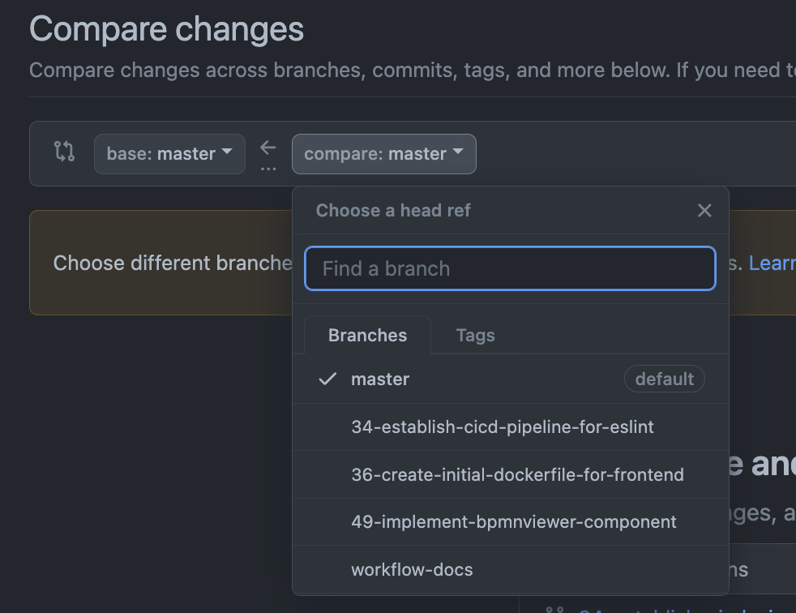
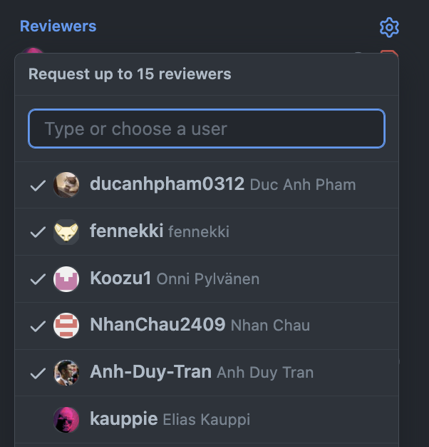
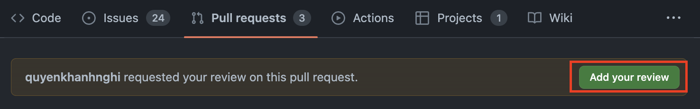

## Workflow documentation
This document is intended to use internally between team members during the project. This is crucial for our workflow for the whole project, so please follow this carefully to not avoid any misunderstanding in the future.

Please do your work with the following steps. You can click each of the steps to get more illustrative details.

- [Workflow documentation](#workflow-documentation)
  - [Create an issue ticket](#create-an-issue-ticket)
  - [Create a branch and work locally](#create-a-branch-and-work-locally)
  - [Create a pull request (PR), waiting for review, making changes, and merge to `master`](#create-a-pull-request-pr-waiting-for-review-making-changes-and-merge-to-master)
  - [Reviewing others' PRs](#reviewing-others-prs)
  - [Notes about code reviews](#notes-about-code-reviews)


### Create an issue ticket
- Open the [project board](https://github.com/users/ducanhpham0312/projects/1/views/1). 
- Under the *Backlog* column, click the **+ Add item** button. <br>
- Select our repository by typing **#** followed by the repository name **zeevision**. 
- In the pop-up menu, select **Create new issue**. <br>
- Then in the pop-up menu, choose **Custom issue template** <br>
- In the issue, add issue title, description and definition of done. Try to write them as clear and as detailed as possible. Also add assignees (if needed) and corresponding labels. Then select **Create**. <br>
  - You might also want to estimate the work for the task with story points. Open the ticket in detailed (by clicking the title) and you should see the **Story points** field. We are using the Fibonacci scale for story points (1,2,3,5,8,13...). Here's my brief description on each.
    - 1: The task is quite simple, you are pretty sure what to do and/or it needs little effort to learn about the task and accomplish.
    - 2: The task is slightly bigger, you can briefly sketch the steps to do it in your head. Little learning is required.
    - 3: The workload for this task is large enough that you are probably not being able to do it in one sitting. It may take some time for you to understand what to do. Some learning is required
    - 5: The task is large. It needs decent amount of investigation, planning, learning, implementing, or even collaboration. 
    - 8+: This task is too large to be in one ticket and one PR. Try to split it task into multiple smaller tasks.
- If you decide to do the task this sprint, move it to the **Todo (current sprint)** column.
### Create a branch and work locally
- Move the ticket you are going to work to the **In Progress** column in the Project Board.
- On your local machine, ensure that your code is on the `master` branch, then run the following commands before starting the work:
    ```
    git pull                            // Get the latest updates from the remote repository
    git checkout -b <your-branch-name>  // Create a new local branch
    ```
- Do the work, commit your work using [Conventional Commits](https://www.conventionalcommits.org/en/v1.0.0/) syntax, and push to your branch (if you're doing the first push, remember to publish the branch first). 
  - Conventional Commit is basically a syntax added to your commit message. The most used syntaxes are:
    - `fix`: Fix a bug that is existing in the current codebase.
    - `feat`: Implementing a new feature to the codebase.
    - `refactor`: Update the codebase that does not affect the functionality of the existing codebase.
    - Other words could be used are `docs`, `ci`, `test`, `style`, `chore`,.... Please refer to Google or the Conventional Commit documentation to learn more.
### Create a pull request (PR), waiting for review, making changes, and merge to `master`
After pushing your code to the remote branch, and you think it completes that task specified in the Project Board, you can create a PR. 
- Go to the [**Pull requests** tab](https://github.com/ducanhpham0312/zeevision/pulls) in the repository. If you recently pushed to the branch, it will prompt to ask you to create a PR. Select **Create Pull request**. If you cannot see it, follow the steps below.
  - Select **New pull request** button. <br>
  - Under **compare** button, select the branch that needs review. <br>
- Write the PR title (NOTE: also follow Conventional Commits, describe what this PR does), a detailed description and how to test this PR as suggested by the PR template.
- Select **Create pull request**
- Open the Project Board and move the ticket to **Code review** column.

Request a review from other members, receive feedback, making changes, getting approval, and merge to `master`
- After creating a PR, remember to select all project members for review (except our customer Locke). <br>
- After reviewing, 3 situations can happen:
  - The reviewer requested some changes to the PR. Usually it is in the form of one big comment of the whole PR in general, followed by some small comments specifically in the code files.
    - Please read the one big comment first and see if there's anything to do there.
    - Check the smaller comments in the files. 
      - If you have a different opinion to such comments, or want to clarify something to the reviewer, you can also add your own comment to it. It's recommended to tag the reviewer as well.
      - If you think the reviewer comment is correct and your code needs a fix, go ahead and do it locally. After the fix, push it to the repo. Remember to click **Resolve conversation** to that comment. Please do it responsibly as most code reviewer will base on that and give you the re-review. You don't want to hide an unresolved problem.
    - After making changes and thinking that it solved all the issues raised by the reviewer, you should re-request review from that reviewer. Now he/she will get notified and review your code again. The *reviewing-requesting change-making change* loop continues until he/she approved it.
  - The reviewer approved your PR with some comments. This means that in general, this PR is completed but need slight modifications. Please update the code accordingly before doing the Squash and merge. 
    - To answer the "Why did he/she approve it but still approve it?" question, this is because the reviewer thinks that the fix is very minor, you can do that on your own, and it doesn't another re-review. This helps the PR can be merged quicker, without waiting for re-review.
  - The reviewer approved your PR with no other comment. In this case, you can click the **Squash and merge** button and complete the work.
- Move the ticket in the Project Board to **Done (current sprint)** column (if not already).

### Reviewing others' PRs
It is stated above that someone will review your PR. This also means that you will also review other's PR! The process of reviewing a PR is the following.
- Read the issue ticket description and the PR description, see what it does and how to test it.
- Open the PR on the browser on one side. Take a look at the name of the branch representing that PR and remember it.
- Open the project locally in the `master` branch. Write the following command:
  ```
  git pull                                  Get the latest updates from master
  git checkout <the-branch-from-that-PR>    Switch to the branch of the PR.
  ```
- Check if the code works as expected after testing. 
- Go back to the browser and select **Add your review** <br>
- As stated above (that there could be 3 ways to receive PR comments), there would also be 3 ways of commenting on other's PR.
  - The PR needs changes. Go to the specific file that you think, after testing, that it should be changed here. Click on the **+** button on next to that line's line number and add a comment. After all your suggested changes are added, select **Review changes** button on the top right, write some general comments about the PRs (and maybe also something that should be fixed before looking into the file-specific comments), select **Request changes** and click **Submit review**. After he/she makes changes, you should get notified, then you should `git pull` the updated code to your local machine. Test it again, request changes if needed... until there's nothing to correct them. Now you can select **Approve** button and complete the review.
  - The PR needs slight modification, and you think it's very small that doesn't need to re-review, you can select **Approve** but with a comment on what he/she should do before merging it to `master`.
  - The PR is good to go. Select **Approve**, maybe add some motivated comments with it (e.g., LGTM, :+1:, Great work etc...) then **Submit review**.


### Notes about code reviews
- Please don't perceive code review comments as any form of attack. They exist to ensure the master branch remains functional and of high quality. These comments also serve as a tool to help you improve. They might come across as blunt, but this directness serves a purpose: it minimizes misunderstandings and enhances efficiency by reducing back-and-forth communication. You should anticipate at least one comment per PR; if there aren't any, the reviewer might not have been thorough enough (with some exceptions). Don't just accept these comments at face value; challenge them and view them as learning opportunities.
- Junior team members should also participate in code reviews. It doesn't require special skills -- just a fresh perspective (which comes naturally) and a questioning attitude. Depending on the size and nature of the changes, a review might take some time. However, you can learn as much from reviewing as you can from implementing the feature yourself. And always remember to test!
  
